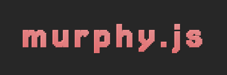

# MurphyJS

<div align="center">
  
  
  <br/><br/>
  
  <!--  -->
  
  
  <br />
  <br />

  A lightweight JavaScript library for creating smooth animations with a simple API.
</div>


## Features

- 🚀 Lightweight and fast (only 3.7KB)
- 🎨 Simple and intuitive API
- 🌈 Beautiful animations
- 📱 Mobile-friendly
- 🎯 No dependencies
- 🎮 Total control of IntersectionObserver parameters
- 🎁 Some animations implemented by default
- 🏝 Plug and play solution to landing pages and simple projects
- ❎ Native fallback to not supported browsers
- 🛎️ Built-in event system for animation lifecycle (in, out, finish, cancel, reset, cleanup)

## Installation

Using npm:
```bash
npm install murphyjs
```

Using yarn:
```bash
yarn add murphyjs
```

For detailed documentation and examples, visit our [documentation site](https://www.murphyjs.org/).

## Quick Start

```javascript
import { Murphy } from 'murphyjs';

// Create a new instance
const murphy = new Murphy();

// Animate elements
murphy.animate('.box', {
  opacity: [0, 1],
  y: [20, 0],
  duration: 1000
});
```

## Usage

### 1. Tag your HTML

In your markup, decorate your element with attribute `data-murphy`:

```html
<div data-murphy="left-to-right">Any content here</div>
```

The default effect of murphy is `bottom-to-top`, but you can also use:
- `top-to-bottom`
- `left-to-right`
- `right-to-left`

### 2. Reset your CSS

In your CSS, reset all the tagged elements:

```css
*[data-murphy] {
  opacity: 0;
}
```

### 3. Start murphy

In JavaScript, import and run `play` when your page is completely loaded:

```javascript
import murphy from "murphyjs";
murphy.play();
```

Or if you're using the script tag:

```html
<script src="./murphy/index.js"></script>
<script>
  murphy.play();
</script>
```

## Configuration

You can configure the animation of each decorated element individually using these attributes:

| Attribute | Type | Default | Description |
|-----------|------|---------|-------------|
| data-murphy | String | 'bottom-to-top' | Animation direction |
| data-murphy-appearance-distance | Int | 50px | Distance from viewport edge to trigger animation |
| data-murphy-element-distance | Int | 30px | Distance the element moves during animation |
| data-murphy-ease | String | 'ease' | Animation easing function (can be a cubic-bezier) |
| data-murphy-animation-delay | Int | 300ms | Delay before animation starts |
| data-murphy-element-threshold | Float | 1.0 | How much of the element needs to be visible to trigger (0-1) |
| data-murphy-animation-duration | Int | 300ms | Duration of the animation |
| data-murphy-root-margin | String | '0px 0px -50px 0px' | Custom root margin for the Intersection Observer |
| data-murphy-group | String | undefined | Group identifier for controlling animations for specific groups of elements |

## Group-based Animations

You can group elements using the `data-murphy-group` attribute. This allows you to control animations for specific groups of elements. For example, you can play or reset animations for only a subset of elements by specifying a group name:

```html
<div data-murphy="bottom-to-top" data-murphy-group="group1">Group 1</div>
<div data-murphy="top-to-bottom" data-murphy-group="group1">Group 1</div>
<div data-murphy="left-to-right" data-murphy-group="group2">Group 2</div>
<div data-murphy="right-to-left" data-murphy-group="group2">Group 2</div>
```

You can then control animations for a specific group using the API:

```js
// Play animations for group1 only
murphy.play('group1');

// Reset animations for group2 only
murphy.reset('group2');
```

## API

| Method | Description |
|--------|-------------|
| play() | Start monitoring elements in DOM tagged with `